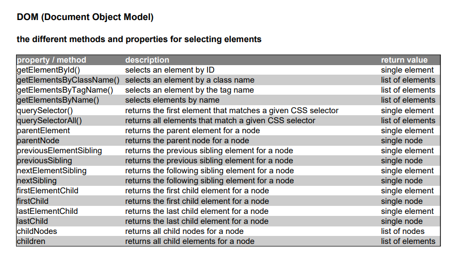

# WebDevelopment_Basics

 ### Basics for fullstack developers

 ## 1 - HTML - structure web pages with HTML
  * ### Part_1 - Use elements and attributes
    - a simple website
  * ### Part_2 - Parameterize elements via attributes
    - use attributes
  * ### Part_3 - Lists
    - ordered list
  * ### Part_4
    - unordered list
  * ### Part_5
    - definition list
  * ### Part_6
    - nested lists
  * ### Part_7 - Links
    - use of external links
  * ### Part_8
    - relative links (links on the same page)
  * ### Part_9
    - internal links (links on the same website)
  * ### Part_10 - Images
    - embedding images
  * ### Part_11 - Captions
    - use of captions
  * ### Part_12 - Tables
    - representation of users with the help of tables
  * ### Part_13
    - Definition of table header (thead), table body (tbody) table footer row (tfoot)
  * ### Part_14
    - combine columns
  * ### Part_15
    - merging rows
  * ### Part_16 - Forms
    - use of the different form elements

 

 

 ## 2 - CSS - design websites with CSS
  * ### Part_1 - Introduction
    - a simple CSS file
  * ### Part_2 - Include CSS in HTML
    - embed CSS file, external, inline, internal
  * ### Part_3 - Texts
    - format texts with CSS
  * ### Part_4 - Lists
    - format unordered lists with CSS
  * ### Part_5
    - formatting an ordered list
  * ### Part_6
    - use images as bullets
  * ### Part_7
    - setting the position of bullets
  * ### Part_8 - Tables
    - design tables with CSS
  * ### Part_9 - Forms
    - designing forms with float layout
  * ### Part_10
    - designing forms with flexbox layout
  * ### Part_11
    - designing forms with grid layout

 

 

 

 

 ## 3 - JavaScript (JS) - making websites interactive with JavaScript
  * ### Part_1 - Introduction
    - JavaScript code that calls a function
  * ### Part_2
    - embedding JavaScript in HTML
  * ### Part_3 
    - a simple hint dialog generated via JavaScript (a simple information dialog generated via JavaScript only makes sense in exceptional cases: definitions of JavaScript directly in an HTML file)
  * ### Part_4 - Use developer console
    - output to the console via the "console" object
  * ### Part_5
    - using the "console" object
  * ### Part_6 - Define variables
    - declaration of variables with the "let" keyword
  * ### Part_7 - Define constant
    - declaration of a constant
  * ### Part_8 - Use data types
    - definition of different number variables
  * ### Part_9
    - examples for the definition of strings
  * ### Part_10
    - definition of boolean variables
  * ### Part_11 - Control structures
    - example of a conditional statement including branching
  * ### Part_12
    - example of a branch with several paths
  * ### Part_13
    - use of the "switch" application
  * ### Part_14 - Use loops
    - a simple "for" loop that outputs the numbers from 1 to 10
  * ### Part_15
    - a simple "while" loop that outputs the numbers from 1 to 10
  * ### Part_16
    - a simple "do-while" loop that outputs the numbers from 1 to 10
  * ### Part_17 - Functions and error handling
    - creating a function using a function declaration
  * ### Part_18
    - creating a function using a function expression
  * ### Part_19
    - create a function using the Arrow function notation
  * ### Part_20
    - call a function
  * ### Part_21
    - use of function parameters
  * ### Part_22
    - a function that returns a value
  * ### Part_23
    - example of the use of a "try-catch" block
  * ### Part_24 - Objects and arrays
    - creating an object via the objelt-literal notation
  * ### Part_25
    - create an array via the shorthand
  * ### Part_26
    - iteration over an array

 

 

 ## 4 - Weblogs

 

 ##  5 - Webformats - use web formats
  * ### Part_1 - Data formats
    - example of a CSV document
  * ### Part_2
    - example of XML document
  * ### Part_3
    - example of XML schema
  * ### Part_4 - JSON
    - example of a JSON document
  * ### Part_5
    - parsing JSON in JavaScript
  * ### Part_6
    - JSON can be embedded directly within JavaScript code
  * ### Part_7
    - example of a JSON schema
  * ### Part_8 - Vector graphics with SVG format
    - example of SVG document
  * ### Part_9 - Audio and video formats
    - embedding video files in HTML
  * ### Part_10
    - embedding video files in HTML
  * ### Part_11
    - embedding audio files in HTML

 

 

 ## 6 - Web APIs
  * ### Part_1 - Select elements
    - selection of all elements with the CSS class "even" and subsequent iteration over the elements
  * ### Part_2 - Change elements
    - create and add a text node
  * ### Part_3 - Dynamically create a table
    - create an object using the object literal notation
  * ### Part_4 - Load data asynchronously with Ajax and the Fetch API
    - load JSON data via Ajax and via Fetch API

  ### JavaScript - HTML DOM Methods
   #### the different methods and properties for selecting elements

 

   #### the different methods and properties for modifying elements

 

 ## 7 - Accessibility (ally) - Optimize websites for accessibility
  * ### Part_1 - Semantically structure web pages
    - definition of structures with the help of the div
    element (no longer up-to-date)
  * ### Part_2
    - definition of structure with the help of the semantic elements for it
  * ### Part_3 - Making forms accessible
    - use of different form elements
  * ### Part_4 - Making tables accessible
    - definition of table description, table header, table body and table footer
  * ### Part_5 
    - definition of table headings that refer to table columns
  * ### Part_6
    - definition of table headings that refer to table columns
  * ### Part_7
    - definition of table headings that refer to table columns
  * ### Part_8 - Define language for web pages
    - definition of the language used for the web page and for a single HTML element
  * ### Part_9 - Offer keyboard support
    - definition of keyboard shortcuts and tab order for links and form elements
  * ### Part_10 - use subtitles
    - defining alternative subtitles for videos

 ## 8 - Single Page Applications (SPA)
  * ### Part_1 - Structure of the application
    - create react app https://create-react-app.dev/docs/getting-started  /  https://reactjs.org
  * ### Part_2 - Local state of a component
    - local state in the list component
  * ### Part_3 - The life cycle of a component
    - server communication in the list component (src/List.js)
  * ### Part_4 - styling of components
    - inline styling in react components
  * ### Part_5 - CSS classes and external stylessheets
    - integration of the stylessheets (src/List.js)
  * ### Part_6 - component hierarchy
    - inclusion of the listItem component (src/List.js)
  * ### Part_7 - Inverse data flow
    - embedding the delete routine in the ListItem component (src/ListItem.js)
  * ### Part_8 - Forms
    - the form component for creating new records (src/Form.js)
  * ### Part_9 - Context API
    - adapting the list component to the context (src/List.js)
  * ### Part_10 - Routing
    - routine definitions in the app component (src/App.js)

 ## 9 - Use Javascript on the server side - Node.js
  ### before you start please install Node.js, you can do that at https://nodejs.org/en/download
   - for macOS download the pkd file
   - for windows download the msi file
   - for linux a binary package is available start there in the directory bin/node file
  ### you can check if the installation was successful
   - macOS - with $ "node -v" the installed version is displayed, with $ "node -v" the installed version is  displayed, and check if npm and npx are also installed with $ "npm -v" and $ "npx -v"
   - window - with $ "node -v" the installed version is displayed, with $ "node -v" the installed version is  displayed, and check if npm and npx are also installed with $ "npm -v" and $ "npx -v"
   - linux - $ "bin/node -v", $ "bin/npm -v", $ "bin/npx -v"
  * ### Part_1 - A simple node.js application
   - open the terminal and start the main.js with $ "node main.js" (pay attention to where the file is stored)
   - "Server is running on http://localhost:8000" open this in your browser
  * ### Part_2 - Use built-in modules
    - read files, write files, delete files (synchronous, asynchronous)
  * ### Part_3 - Deploy static files
    - customized webserver now deploys the HTML file and CSS file
     - open the terminal and start the start.js with $ "node start.js" (pay attention to where the file is stored)
   - "Server is running on http://localhost:8000" open this in your browser
  * ### Part_4 - Use web framework "express" (http://expressjs.com)
   - #### first please install express, open the project and open the terminal and enter "npm install express" then express will be installed locally for this project
   - a webserver with the web framework express
   - customized webserver now deploys the HTML file and CSS file
   - open the terminal and start the start.js with $ "node start.js" (pay attention to where the file is stored)
   - "Server is running on http://localhost:8000" open this in your browser
* ### Part_5 - Use web framework "express" (http://expressjs.com)customized webserver processes the data
   - customized webserver processes the data
   - customized webserver now deploys the HTML file and CSS file
   - open the terminal and start the start.js with $ "node start.js" (pay attention to where the file is stored)
   - "Server is running on http://localhost:8000" open this in your browser

 

 - if the installation of express was successful the folder node_module should have been created

 ## 10 - Implementing web services 
  * ### Part_1 - SOAP  (Simple Object Access Protocol)
   - example for a: WSDL file(WSDL 2.0), SOAP request, SOAP response
  * ### Part_2 - REST (Representational State Transfer)
   - example for the resource https://www.alberteinstein.com/api/books/4
  * ### Part_3
   - example for the resource https://www.alberteinstein.com/api/authors/1
  * ### Part_4
   - implement a REST-API (npm install express  -->  node start.js)